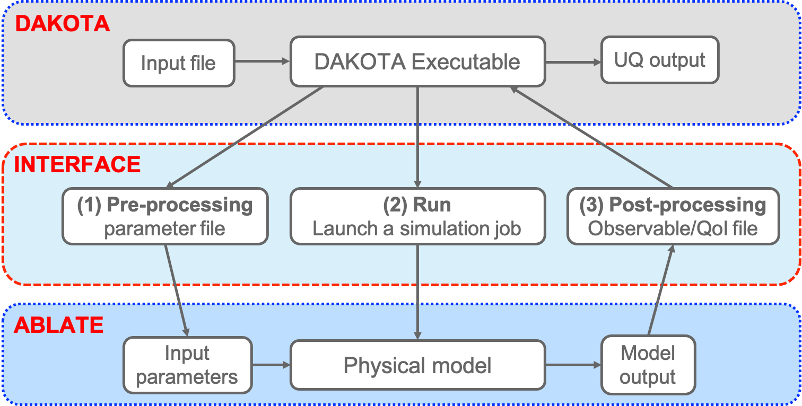

# Using DAKOTA with ABLATE For Uncertainty Assessment


## DAKOTA Introduction (Version 6.15)

DAKOTA (Design Analysis Kit for Optimization and Terascale Applications) is an open-source software developed and maintained by Sandia National Labs. It provides robust, usable software for optimization and Uncertainty Quantification (UQ). 
The Dakota software's advanced UQ analyses enable forward and inverse uncertainty propagation with the various mechanistic models implemented in ABLATE. 
One of the primary advantages of DAKOTA is access to a very broad range of iterative capabilities that can be obtained through a relatively simple interface between DAKOTA and ABLATE.
For uncertainty assessment of [UB CHREST](https://www.buffalo.edu/chrest.html) project, we leverage the following DAKOTA's capabilities 

1. uncertainty quantification with sampling and emulators;
2. parameter estimation using Bayesian inference; and
3. variance-based global sensitivity analysis.

Information about DAKOTA algorithms and capabilities can be found in [DAKOTA Manuals](https://dakota.sandia.gov/content/manuals). 
To download and build DAKOTA using Linux or Mac OS platforms, please refer to [Installing DAKOTA](https://dakota.sandia.gov/content/install-dakota).


## Interfacing DAKOTA and ABLATE
This section will provide a step-by-step guide to interfacing DAKOTA with ABLATE. The interface described here is based on running ABLATE using a text input file (.yaml), and the interface driver is developed in python with the goal of enhancing the adaptation of UQ analyses by all UB CHREST members.
This guide assumes that you are building and running ABLATE and DAKOTA on your local machine or CCR.


### DAKOTA-ABLATE Simulation Workflow

The mechanics of how DAKOTA communicates with and runs an ABLATE simulation are demonstrated in this figure.



For most UQ analyses, DAKOTA calls/runs the ABLATE simulation using the following steps: 

1. Dakota writes an input file (.yaml) that contains values for each variable
2. Dakota invokes the ABLATE analysis driver, passing it the names of the parameters and outputs files
3. The interface driver performs three tasks to map parameters to results:
- **Pre-processing:** Create ABLATE input file using values from the DAKOTA parameters file
- **Run:** Run the ABLATE simulation based on the input
- **Post-processing:** Extract simulation outputs (responses) from the ABLATE output file(s) and write them to the named DAKOTA results file

4. The ABLATE interface exits, and DAKOTA opens and reads the results file.


### Example: Global Sensitivity Analysis of Chemical Kinetics Models

These directions outline the steps for setting up DAKOTA UQ analysis on an ABLATE simulation. The example provided here enables you to formulate your problem, present it to DAKOTA, and run the studies. You can easily use the same setup and modify the provided files according to other models in ABLATE and different UQ analyses of DAKOTA.

The physical problem in this example is the chemical kinetic simulation of Methane implemented as a two-step reaction in ABLATE. The parameters of this model are activation energies, and the model output is the ignition delay. The UQ analysis consists of the variance-based global sensitivity analysis (VSA) to determine the importance of each model parameter on the uncertainty of model output. In addition, we leverage the Monte Carlo estimator of DAKOTA to evaluate the total effect Sobol sensitivity index of each parameter.


#### 1 - Set up the ABLATE chemical kinetic model:
The files required for running the simulations are:

-	The ABLATE input file, `ignitionDelay2S_CH4_CM2.yaml`, that can be obtained from the [ABALTE documentation](https://github.com/UBCHREST/ablate/tree/main/tests/integrationTests/inputs/reactingFlow)
-	The mechanics of how DAKOTA communicates with and runs an ABLATE simulation are demonstrated in this figure.

By running the `ignitionDelay2S_CH4_CM2.yaml` with the parameters specified in `2S_CH4_CM2.mech.dat`, ABLATE computes the ignition delay output and saves it in ignitionDelayTemperature.txt.

Identifying the ABALATE simulation inputs and outputs is the key factor in the UQ analysis and DAKOTA integration. In this example, we want to compute the sensitivity indices of two parameters, the activation energies of each reaction. The figure below shows a part of the `2S_CH4_CM2.mech.dat` in which the two parameters are highlighted.


The figure below highlights the model output (ignition delay) in the `ignitionDelayTemperature.txt`.


#### 2 - Set up the DAKOTA sensitivity analysis:

The DAKOTA input file for the VSA of the chemical kinetics model, `sensitivity.in`, is shown below. Refer to [DAKOTA Reference Manual](https://dakota.sandia.gov/content/manuals) for guidance in specifying keywords in other UQ analyses. The essential parts of the sensitivity.in for the VSA of this example are:

- *methods:* 
sensitivity analysis using the Monte Carlo sampling method based on Latin hypercube samples (LHS). Using 100 samples of parameters for VSA
- *variables:* 
two model parameters, x1 and x2, are considered for sensitivity analysis. The parameters' uncertainty ranges are assigned using the upper_bounds/lower_bounds of the uniform distributions.
- *interface:* 
the interface driver file for integration with ABLATE is assigned as `driver.py`
- *responses:* 
one output is taken into account for the VSA


The contents of `sensitivity.in` is below:
```bash
environment,
    tabular_data
method,
  sampling
    sample_type lhs
    samples = 100
    variance_based_decomp
variables,
  uniform_uncertain 2
    upper_bounds      2.4     2.4 
    lower_bounds      1.6     1.6
    descriptors 'x1' 'x2'
interface,
        fork
        analysis_drivers = 'python driver.py params.in results.out'
        parameters_file = 'params.in'
        results_file    = 'results.out'
        verbatim
responses,
	response_functions = 1
	no_gradients
	no_hessians
```

#### 3 - Set up DAKOTA-ABLATE interfacing:

The goal of the interfacing stage is to allow DAKOTA to control the parameters and outputs of the ABLATE simulations. In this example, the model parameters are the two values in `2S_CH4_CM2.mech.dat`, and the model output is a value printed by ABLATE in the `ignitionDelayTemperature.txt` indicated in step 1. The role of the interface driver file, `driver.py`, is to perform three tasks:

- **Pre-processing:** Create a new and temporary `2S_CH4_CM2.mech.dat` for each parameter sample generated by DAKOTA. We created `ORIGINAL_2S_CH4_CM2.mech.dat` used to generate temporary `2S_CH4_CM2.mech.dat` for each parameter sample. 
- **Run:** Run the ABLATE simulation based on the `ignitionDelay2S_CH4_CM2.yaml` input file 
- **Post-processing:** Extract the ignition delay output computed using each parameter sample from the `ignitionDelayTemperature.txt` computed by ABLATE output file(s) and write them to the DAKOTA results file

The `driver.py` is below with self-explanatory comments showing each task:
```bash
import dakota.interfacing as di
import numpy as np
import os
import subprocess


# Pre-processing: Create ABLATE input file using values from the DAKOTA parameters file
# --------------------------------------------------------------------------------------

# parameter sample from DAKOTA 
params, results = di.read_parameters_file()
x1=params['x1']*1E+15
x2=params['x2']*1E+9

# generate a new 2S_CH4_CM2.mech.dat with new parameter values (sample)
with open ('ORIGINAL_2S_CH4_CM2.mech.dat', "r") as myfile:
    inputfile = myfile.readlines()
    inputfile[19] = 'CH4+1.5O2=>CO+2H2O '+str(x1)+'  0.00   35000.00\n'
    inputfile[22] = 'CO+0.5O2<=>CO2 '+str(x2)+'  0.000   12000.00\n'
    np.savetxt('2S_CH4_CM2.mech.dat', inputfile, fmt='%s',delimiter='')


# Run: Run the ABLATE simulation using the .yaml input and the new 2S_CH4_CM2.mech.dat
# --------------------------------------------------------------------------------------
command = 'module use /projects/academic/chrest/modules; module load chrest/release ; $ABLATE_DIR/ablate --input ignitionDelay2S_CH4_CM2.yaml  '
p = subprocess.Popen(command, stdout=subprocess.PIPE, shell=True)
(stdout, err) = p.communicate()
output = stdout.splitlines()


# Post-processing: Extract simulation outputs (ignition delay) from the ABLATE output file 
# and write them to the named DAKOTA results file
# --------------------------------------------------------------------------------------

# extract ignition delay value from the ABALTE output ignitionDelayTemperature.txt
with open ('_ignitionDelay2S_CH4_CM2/ignitionDelayTemperature.txt', "r") as myoutfile:
    outfile = myoutfile.readlines()
    targetline = outfile[0].split(':')
    QoI = float(targetline[1])
    print(QoI)

# remove the temporary ABLATE input/output files  
os.remove('2S_CH4_CM2.mech.dat')
os.remove('_ignitionDelay2S_CH4_CM2/ignitionDelayTemperature.txt')

# write the output to the DAKOTA results files
for i, r in enumerate(results.responses()):
    r.function = QoI
results.write()
```


#### 4 - Running the UQ analysis and postprocessing results  

After setting up the ABLATE chemical kinetics simulation, DAKOTA sensitivity analysis, and the interface driver, we are ready to run the `sensitivity.in` using DAKOTA by, for example:

```
srun --overlap dakota -i sensitivity.in
```

In this example, the estimated sensitivity indices for the two parameters are 1.0291374111e+00 for `x1` and 6.5804625316e-03 for `x2`, showing that the activation energy of the reaction of the first chemical interaction (CH4+1.5O2=>CO+2H2O) is the most important parameter, while the second parameter does not contribute to the ignition delay.

