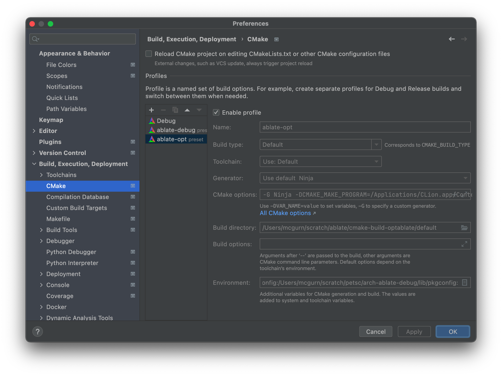
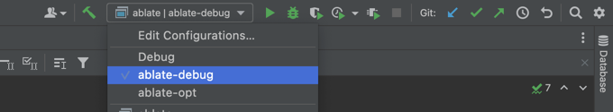
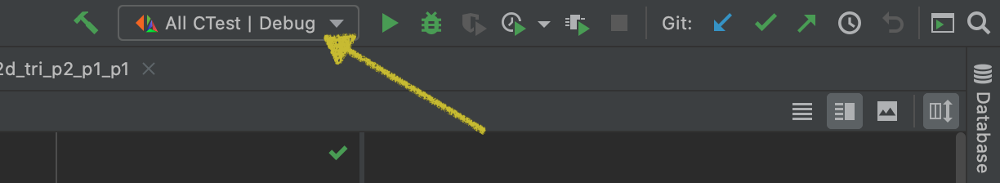

These directions outline the steps for downloading, building, and testing ABLATE on your local computer. There are a variety of ways to build and interact with ABLATE including the command line and integrated development environments (IDEs). This document will cover building with the command line (WSL on Windows) and [CLion](https://www.jetbrains.com/clion/).

## Note:
For the most recent development issues, notes, and workarounds for building ABLATE check the [ABLATE repo wiki](https://github.com/UBCHREST/ablate/wiki).

## Downloading and Building with CLion (with docker dependencies)
CLion is a C/C++ IDE that uses cmake files for configuration. These directions outline the steps to running the framework with CLion.
1. Download and install [Docker](https://www.docker.com) or docker desktop.
2. Pull the latest ablate dependency docker image
   ```bash
   docker pull ghcr.io/ubchrest/ablate/ablate-dependencies:latest
   ```
3. Download and Install [CLion](https://www.jetbrains.com/clion/). For Windows users it is recommended that CLion be [installed under WSL2 linux](https://docs.microsoft.com/en-us/windows/wsl/tutorials/gui-apps).
4. Open CLion and select *Get From VCS* from the welcome window and either
   - (recommended) Select GitHub and Login/Authorize access. Then follow on screen instructions to clone your [fork of ABLATE]({{ site.baseurl}}#forking-ablate).
   - Select Git from the *Version Control* drop down and enter your [ABLATE fork url]({{ site.baseurl}}#forking-ablate).
4. Set the toolchain in CLion using the [instructions](https://www.jetbrains.com/help/clion/clion-toolchains-in-docker.html).  Select the 'ghcr.io/ubchrest/ablate/ablate-dependencies:latest' image in the UI.
5. Enable the ablate-debug/ablate-opt build profiles.
   - If not opened by default, open the  Settings / Preferences > Build, Execution, Deployment > CMake preference window from the menu bar.
   - Select the ablate-debug  and click the "Enable profile". Repeat for the ablate-opt and apply/close the window.
     
   - Select the ablate-opt or ablate-debug build profile under the build tool bar.  In short, the debug build makes it easier to debug but is slower.  The release/optimized build is faster to execute.
     
   - Delete all other profiles
6. Build and run all tests using the *All CTest* configuration.
   
7. If you are new to CLion it is recommended that you read through the [CLion Quick Start Guide](https://www.jetbrains.com/help/clion/clion-quick-start-guide.html).

## Downloading and Building with CLion (with installed dependencies)
CLion is a C/C++ IDE that uses cmake files for configuration. These directions outline the steps to running the framework with CLion.
1. These directions assume you have installed dependencies and set up the environmental variables outlined in [Installing Dependencies Locally]({{ site.baseurl}}).
2. Download and Install [CLion](https://www.jetbrains.com/clion/). For Windows users it is recommended that CLion be [installed under WSL2 linux](https://docs.microsoft.com/en-us/windows/wsl/tutorials/gui-apps).
3. Open CLion and select *Get From VCS* from the welcome window and either
   - (recommended) Select GitHub and Login/Authorize access. Then follow on screen instructions to clone your [fork of ABLATE]({{ site.baseurl}}#forking-ablate).
   - Select Git from the *Version Control* drop down and enter your [ABLATE fork url]({{ site.baseurl}}#forking-ablate).
4. Enable the ablate-debug/ablate-opt build profiles.
   - If not opened by default, open the  Settings / Preferences > Build, Execution, Deployment > CMake preference window from the menu bar.
   - Select the ablate-debug  and click the "Enable profile". Repeat for the ablate-opt and apply/close the window.
     
   - Select the ablate-opt or ablate-debug build profile under the build tool bar.  In short, the debug build makes it easier to debug but is slower.  The release/optimized build is faster to execute.
     
5. Build and run all tests using the *All CTest* configuration.
   
6. If you are new to CLion it is recommended that you read through the [CLion Quick Start Guide](https://www.jetbrains.com/help/clion/clion-quick-start-guide.html).

## Downloading and Building with the Command Line
1. These directions assume you have installed dependencies and set up the environmental variables outlined in [Installing Dependencies Locally]({{ site.baseurl}}).
2. Clone your [ABLATE fork]({{ site.baseurl}}#forking-ablate) onto your local machine. It is recommended that you [setup passwordless ssh](https://docs.github.com/en/github/authenticating-to-github/adding-a-new-ssh-key-to-your-github-account) for accessing GitHub.
   ```bash
   git clone git@github.com:USERNAME/ablate.git
   ```
3. Create debug and release build directories
    ```bash
    mkdir debug
    mkdir release
    ```
4. Configure and build ABLATE
    ```bash
    # debug mode
    cmake -DCMAKE_BUILD_TYPE=Debug -B debug -S ablate
    make -C debug

    # release
    cmake -DCMAKE_BUILD_TYPE=Release -B release -S ablate
    make -C release
    ```
5. Run all the ABLATE tests
   ```bash
   cd release
   ctest
   ```