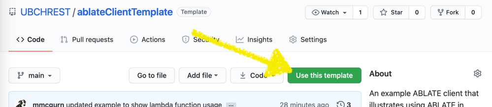

ABLATE is designed so that you can use it in your own application.  If your application uses CMake you can include ABLATE as a sub-project or using FetchContent (shown in the following example).

```cmake
include(FetchContent)

# Download and make ablate available to the client
FetchContent_Declare(
        ablate
        GIT_REPOSITORY https://github.com/UBCHREST/ablate.git
        GIT_TAG v0.2.6
)
FetchContent_MakeAvailable(ablate)

target_link_libraries(yourApplication PUBLIC ablateLibrary)
# or
target_link_libraries(yourApplication PUBLIC ablateCore)
```

There are two primary libraries you may want to include.  AblateCore is the low-level c functions directly using PETSc.  Using this library assumes that you are comfortable with PETSc.  AblateLibrary is a higher level wrapper for ablateCore that can simplify problem setup.  Control the version of ablate directly in your project using FetchContent_Declare.

## Template Client Project
A simple [template client project](https://github.com/UBCHREST/ablateClientTemplate) is available to get started.  You can create your own repository from this template as shown.  How you organize the project is up to you. You can have one repository per setup or multiple main statements in a single project.  To get the latest version of ABLATE in your project, simply update the version in FetchContent_Declare. Two example files are provided in the client library showing the use of ablateCore and ablateLibrary.  You can add any additional files using the pattern shown in CMakeLists.txt.
    

If you are using the template client project to develop new functionality for ABLATE you can use a local copy of ABLATE as outlined in [template client readme](https://github.com/UBCHREST/ablateClientTemplate/blob/main/README.md). Once developed and tested these capabilities should be integrated back to ABLATE with full testing and parser support.
