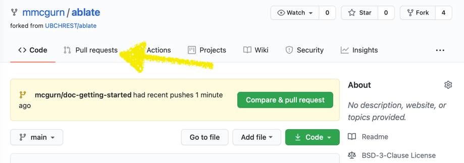
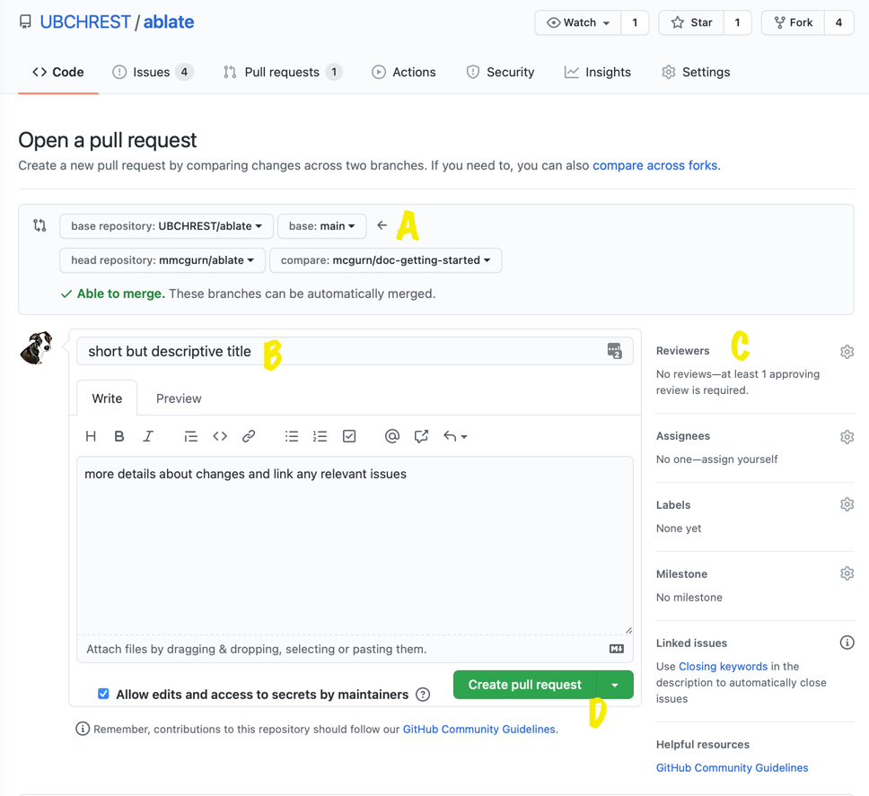

It is highly recommend that you merge your changes back into ABLATE often.  This is done using a [Pull Request](https://docs.github.com/en/github/collaborating-with-issues-and-pull-requests/about-pull-requests), which asks the team to review and "pull" your changes back into ABLATE from your fork/branch.
1. Start on your feature branch outlined in [Working with Git](#working-with-git) with any changes that you would like to share.
1. Update any documentation within the docs folder.
1. Update and create any needed tests.  The [GoogleTest](https://github.com/google/googletest) framework is used to control and monitor tests.
1. Make sure that all code meets [formatting requirements]({{ site.baseurl }})
    ```bash
    # To run a format check from build directory
    make format-check
    ```
1. Update the ABLATE version in the CMakeLists.txt file in the root of the project following [semantic versioning](https://semver.org/).
1. Follow the [Working with Git](#working-with-git) steps to commit and push any additional changes.
1. Navigate to your fork of ABLATE on GitHub.com.
1. If presented with the button to "Compare & pull request" you can select this.  Otherwise, select the "Pull requests" tab and select the "New pull request" button.
   
1. Configure and create your pull request
    1. Check the source and destination repositories.  The source repository should be your feature branch on your fork.  The destination repository should be UBCHREST/ablate main.
    1. Add a title and detailed description.  Within the description you should link/close any related issues.
    1. Assign any reviewer that you would like to review the pr.
    1. Create the pull request
       
1. Squash and Merge your pull request once all of the tests have run/pass and your code changes are reviewed.  If the tests fail or if changes are requested you can simply make changes to your local branch and push.  The PR will be automatically updated and the tests re-run.
1. Once your code changes have been merged, you will want to [update your fork](#updating-your-fork).
