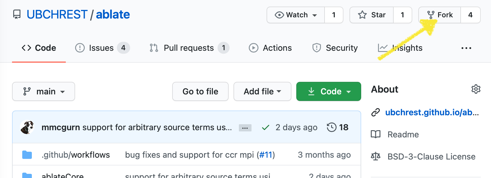
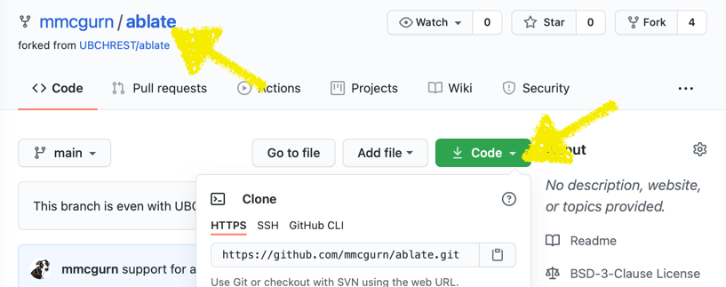

## Git Introduction

Version control is a fundamental aspect of successful software development regardless of the target product or development team.  ABLATE is using Git for version control hosted on [Github.com](https://github.com/UBCHREST/ablate).  Git and the associated workflows define how people develop, document, test, and contribute code to the project.  If you are new to Git or unsure/unconvinced why we are using version control it is recommended that you watch the [Git Introduction by Alicia Klinvex](https://www.youtube.com/watch?v=0dkvuC8MzPI) presented at Argonne Training Program on Extreme-Scale Computing 2017.  [Learn Git Branching](https://learngitbranching.js.org) is an interactive tutorial to help learn Git and is recommend for anyone new to Git or version control. The following guide provides quick reference to some of the common Git workflows as applied to ABLATE.

<iframe width="560" height="315" src="https://www.youtube-nocookie.com/embed/0dkvuC8MzPI" title="YouTube video player" frameborder="0" allow="accelerometer; autoplay; clipboard-write; encrypted-media; gyroscope; picture-in-picture" allowfullscreen></iframe>

## Forking ABLATE
If you plan on making any contributions to ABLATE you must first fork ABLATE.  This creates a version of ABLATE that you can modify, commit, and test. When complete, you can create a Pull Request to bring your changes back to the main branch. [GitHub Forking Documentation](https://docs.github.com/en/github/getting-started-with-github/fork-a-repo) provides a very detailed summary of creating and using forks.

> "A fork is a copy of a repository. Forking a repository allows you to freely experiment with changes without affecting the original project." - GitHub

1. **Sign Into GitHub**  If you do not already have a GitHub account, you will need to [create](https://github.com/join) a GitHub account to fork and contribute to ABLATE.  
1. **Navigate to ABLATE Repo** Navigate to the ablate repo at https://github.com/UBCHREST/ablate.
1. **Fork the Repo**  Press the "Fork" button in the upper-right-hand corner of the page and follow the on-screen directions to create your own fork.
   
1. **Get your Fork Url** You now have a fork of the ABLATE repository.  You can make changes and try new things without concern of breaking ABLATE.  You can tell when you are in your fork by looking at the upper left-hand corner where it should say YOURUSERNAME/ablate.  You will need your fork git url in future steps.  This can be found by clicking the Code button.
   

## Working with Git
Git allows you to easily collaborate between people, back-up your code, and keep track of your changes. It is recommended that you make your code changes on a branch within your fork. The "feature" branch is usually a single set of changes to accomplish one feature or fix a bug.  The following steps use the command line but can often be performed using your IDE (i.e. [Clion](https://www.jetbrains.com/clion/), [VisualStudio Code](https://code.visualstudio.com)) or a stand alone app (i.e.[GitHub Desktop](https://desktop.github.com)).

1. **Creating a Branch** Before working on new code you should create a feature branch.  You probably want to [update your fork](#updating-your-fork) before branching.  Common convection is to name your branch after the feature/bug you are addressing (e.g. USERNAME/FEATURE-BUG, mmcgurn/faster-algorithm)
   ```bash
   # From inside your repository create a branch using the following naming template
   git checkout -b USERNAME/FEATURE-BUG
   ```
2. **Committing your Code** Because you are on your own branch/fork you can and should commit your code often.
   ```bash
   # Get a list of changes to your code
   git status
   
   # Stage the changes.  To add all files
   git add -A

   # or a specific file
   gid add path/to/file
   
   # Commit the staged changes
   git commit -m "detailed message about changes"
   ```
3. **Push your Changes**  Everything done thus far has been only on your local machine.  Once your commit is pushed to origin you can continue your work on other machines, test your code on a cluster, or start a pull request.
   ```bash
   # Commit your code as outlined in the previous step
   
   # Push to origin
   git push
   
   # If this is the first time pushing a branch you get an error like "fatal: The current branch mcgurn/doc-getting-started has no upstream branch." Follow the on screen instructions to set the remote information and push. 
   ```

## Updating your Fork
You will need to sync your ABLATE fork with upstream to keep it uptodate.  The easiest way is to sync a fork using the [WebUI](https://docs.github.com/en/pull-requests/collaborating-with-pull-requests/working-with-forks/syncing-a-fork#syncing-a-fork-branch-from-the-web-ui).

