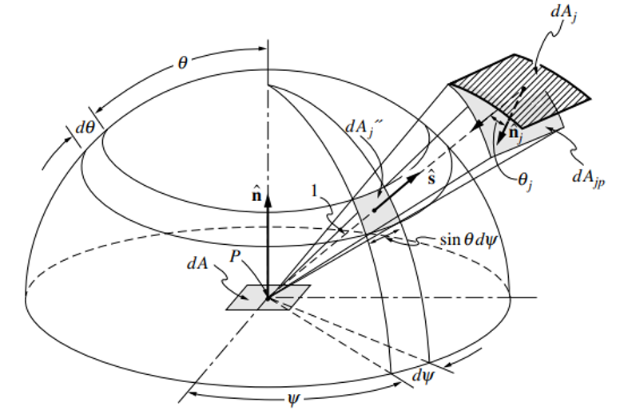

# Radiation Heat Transfer

## Mathematical Formulation

Radiation heat transfer makes up a source term in the energy equation, which has the radiative gains and losses as its
components. While the losses are easy to calculate (using only the properties of the cell in question), the gains
involve the entire domain. This means that in order to solve for the radiative gains of a single cell, remoteRays are traced
from the boundaries of the domain into the cell center. The values of the remoteRays represent the amount of energy
transferred into the cell from the environment. The summation of these remoteRays about a solid sphere of angles results in
the
radiative gain that the cell experiences from its environment. The calculation of the energy source term due to
radiation is shown below.

$$ -\nabla \cdot (\vec{q_{rad}}) = -\kappa (4 \sigma T^4 - G_{irr}) $$

The left-hand side is the negative divergence of radiative heat. Another way to represent this is the amount of heat
entering the cell. The right-hand side shows the difference between the heat leaving and entering the cell. This
difference is multiplied by the absorption of the medium which the cell occupies. $G_{irr}$ represents the amount of
energy entering the cell through radiation. Most of the effort of the solver is spent on the calculation of this term.

The calculated radiation term becomes a source term in the energy equation. The energy equation is as follows.

$$ \rho C_p \frac{D T}{D t} + \nabla \cdot (\rho e \vec{v}) = - \nabla \cdot (\vec{q_{rad}} + \vec{q_{cond}}) + Q_
{source} $$

$\rho$ is density, $C_p$ is constant pressure specific heat, $T$ is temperature, $e$ is internal energy, $\vec{v}$ is
velocity, $\vec{q_{rad}}$ is radiative heat, $\vec{q_{cond}}$ is conductive heat, $Q_{source}$ represents an energy
source term.

$G_{irr}$ represents the irradiation on the cell by its environment. Ray tracing solves the problem of
calculating irradiation by discretizing the solid sphere, or breaking it into pieces, and casting discrete remoteRays into the
domain. The radiative properties along these remoteRays are calculated, and the final radiation due to each ray is contributed
to the cell. A finite number of remoteRays can be used to approximate the total irradiation from every direction. The figure
below shows angles considered for the irradiation of a surface. For our
purposes, $\theta$ is extended to $2 \pi$ in order to include the entire sphere and
the irradiation of the cell as a volume. The figure describing the solid sphere formulation is shown below.

$$ G_{irr} = \int_{0}^{2\pi} \int_{0}^{\pi} I_{pt}(\theta,\phi)\ sin\theta\ d\theta\ d\phi $$

The summing of ray intensities around the whole solid sphere is shown. The contribution of each individual ray is added
to the total irradiation of the solid sphere. The presence of the sine term is
an artifact of the polar coordinates. For example, at $\theta = 0$, all remoteRays at each $\phi$ occupy the same point.
Therefore, they are all weighted at 0. Because of this, no remoteRays are cast in the vertical direction. They begin at a
small angle and are equally spaced through $\theta$. The effects of this integral must be broken into a discrete
formulation in order to be of use computationally. The equation below represents the actual discretization of the above
integral.

$$ G_{irr}\ = \sum_{\theta=0}^{n_{\theta}}\sum_{\phi=0}^{n_{\phi}} I_{pt}(\theta,\phi)\ sin\theta\ \Delta \theta\ \Delta
\phi $$

The third equation shows how the irradiation is calculated for a cell. Each ray is weighted by its partial
area. The “sine of theta” in this equation represents a conversion from polar coordinates. At each theta there is an
equal number of remoteRays around the circumference of the band. However, the lower bands have a lower density of remoteRays
compared to the high bands (small theta). Therefore, when theta is 0 and many remoteRays occupy the same point, they are
weighted as 0 and so on.

With this solid angle formulation, many remoteRays can be generated for each cell and their intensities individually
calculated.

The radiation implementation in ABLATE must handle participating media, an absorbing media that attenuates the radiation
passing
through it. Radiation solvers are typically formulated to calculate the radiation into a point based on the amount of
radiation incoming from a solid sphere of directions.

The discrete transfer method involves decomposing the solid sphere into many discrete remoteRays. These remoteRays describe the
amount of radiation that reaches the point for which the radiation is being calculated.

The calculation of radiative intensity implemented in this radiation solver is based on the radiative transfer equation.
This equation describes how the intensity of radiation changes through participating media.

$$\frac{d I}{d x} = \kappa (\frac{\sigma T^4}{\pi} - I)$$

Note that the change in intensity is proportional to the product of the intensity difference and the absorption at a
given point. This radiative transfer equation is implemented for each ray. All remoteRays are summed along the solid sphere.

The behavior of the radiative transfer equation indicates that a strongly absorbing media will change the intensity of
a ray over a very short distance. The temperature of the ray will follow the temperature of the medium with a first
order response.

## Computational Methods

Here the Discrete Transfer Method (DTM) has been applied in the context of domain decomposition parallelization.
Employing the mathematical formulation described above, the discrete transfer method has some advantages over competing
methods.

Its first advantage is that it is not very computational expensive. Competing methods include the Monte Carlo
Method which, despite allowing increased complexity without significant increase in cost, is quite costly to implement.
Other methods include the Discrete Ordinance Method and Spherical Harmonics.

The second advantage of the discrete transfer method is its accuracy. Some methods do not converge to the exact solution
of a given problem despite an increase of solver resolution. The DTM converges to the exact solution of a given problem
with increased solver resolution, which is desirable within this DNS.

### Assumptions

This implementation of radiation heat transfer will ignore spectral dependencies. This is because ignoring wavelength
reduces the computational complexity significantly without sacrificing much accuracy in the context of the combustion
environment. This will be referred to as the grey gas assumption. The physical significance of this assumption is that
the media and surfaces within the simulation domain are assumed to be grey, or without color.

The solver currently ignores any effects due to reflection, scattering, or refraction. These effects can be ignored
while still achieving a reasonable degree of accuracy in the cases being analyzed here. The solver has been formulated
such that adding reflection is possible in the future. Reflection is the most significant additional effect that could
be considered.

Surface effects have yet to be taken into account within the radiation solver. In the future, the effects of radiation
heat transfer into the surface of the wax will need to be considered within the context of its contribution to the
sublimation of fuel off of the surface of the wax. The machinery associated with the current functioning of the solver
can be effectively applied here, despite the solver only being designed to interface with cell volumes and not the
surface of cell faces up to this point. The ray tracing process can be carried out for each face for which the radiative
heat flux is desired. Rays can then be cast from the surface of the face over the hemisphere normal to it.

### Implementation

The procedure for the implementation of this method is as follows. The solver is broken into an initialization and a
solve step. The initialization is responsible for forming the ray segments which the properties of the domains are read
from later on. Each ray is likely to cross a domain boundary. This means that the formation of the ray segments based
on their geometry is a highly global communication process. The global communication and coordination of this process
is assisted by PETSc particles. The particle functionality is useful in this process for two reasons. First, the
particles can be passed from one domain to another based on their physical coordinates. This means that search
particles can be transported effectively from one domain to another simply stepping them through space along their
ray line. The second useful attribute of particles in this application is that they can carry information across domains
as they complete their migration process. The definition of the information is arbitrary. In every implementation of the
particles for the radiation solver, information has been stored in a small number of structs in the respective
particle fields.

The initialization of the solver forms the infrastructure for the gathering of ray information and
communication across domains. The particles are transported through space along their remoteRays in order to inform the local
domain of what remoteRays exist there. The particles are responsible for identifying which cells belong to which ray segment,
and creating an associated local storage of information which is globally identifiable to a specific ray segment. It
also is responsible for creating a communication infrastructure which will be used in the later solve steps. The purpose
of
the communication infrastructure is to carry identifiable ray segment property information from the domain in which the
segment is contained to the domain in which the origin cell is contained. The ray segment property information can then
be used by the origin cell in order to sum the ray intensities and compute the final irradiation. Therefore, as each
particle travels through a domain associated with a process, that process will establish a local ray segment in memory
along with a carrier particle for the solve step described. When all particles have exited the simulation domain, the
ray segment establishment is complete. Each process will have a ray segment collection which is globally linked to a
cell in another domain. It will also have the carrier particle which is responsible for containing and transporting the
information associated with these cell segments.

The steps of the initialization are as follows:

1. Initialize a number of particles at the center of each cell. Each of these particles is associated with a ray. Each
   particle is given a position and direction from which it will move outward. The particle carries a global identifier
   with it. This way, the solver particles and ray segments that it creates along the way will be globally identifiable
   and
   may be communicated to the proper location in the global mesh.
2. The initialized particles in a given local domain are iterated through. Each particle location is evaluated and the
   cell it occupies is added to the unique local ray segment. The length of the path it has travelled in order to reach
   this cell is also recorded in order to assist the computation of attenuation processes. This only happens if the
   particle is occupying a new cell. This is because the use of adaptive space stepping has been implemented in order to
   speed the solve process.
3. Each particle is stepped through space by one step. The coordinate location of every particle is updated.
4. The particles are migrated. The migration process moves every cell that has crossed a rank boundary to the new rank.
   The particle carries all of its information with it into the new rank. It can be globally identified as belonging to
   a
   given ray by its identifier. The remoteRays that it established in this new rank will be globally associated with the
   origin
   cell through the established communication scheme.

After the completion of this initialization, the solver may move on to
the solve step.

The computation of the energy source term, or the solve, is completed in three stages.

1. Locally compute the source and absorption for each stored ray identifier while updating the segment values to the
   fields of the carrier particles. (based on the ray identifier)
2. Send the particles to their origin ranks in order that the final computation can be completed.
3. Compute energy for every cell by searching through all present (transported) particles.

Notice that the local computation of the ray segment properties is computed first. In the former version of the serial
solver, the computation of the ray intensities was completed linearly through the ray. The crossing of domains requires
that the remoteRays be broken into local segments. However, the ray intensities could still be computed linearly through the
entire ray.
The organization of the solve into these steps has a few key advantages. The first advantage is that each solve step
only has one communication through the entire domain. The previous approach involves moving information linearly
through the entire ray. In this case, multiple communications would occur for each ray. Even if these communications
were synchronized, the differing number of segments in each ray
would mean that the number of communications is unknown and that the majority of the processes could be idly waiting
for the last communication. The second advantage is that the communication of the information in this manner requires
only one communication for each ray segment. If the remoteRays were solved through linearly, each process would require two
communications. The first communication would move information into the domain and the second communication
would move information out of the domain. The organization of all ray segment information to the origin rank in one
step allows for a single communication where the segment order of information is handled by the local process.

It would be possible to avoid multiple communications by simply transporting all environmental information into the
domain of the to which it belongs. However, this increases the volume of information that is being communicated by
orders of magnitude and is therefore unhelpful. The ray segments must be handled before the communication such that
a minimum of information is transported from the domain. Of course, a ray segment can be completely described by two
values: Absorption, the proportion of radiation attenuated through the segment, and intensity, the amount of radiation
emitted from the segment.

Breaking up ray segments into independent objects which can be arranged at one point requires a mathematical
formulation that differs from that implemented in the serial solver. Here, the governing differential equation is
derived differently to support multiple levels of ray segments. Now, each ray segment can be solved prior to the
communication and each segment can be treated as two individual values after the communication.

$$ I = I0 \prod_{D = 0}^{N_D} (\prod_{C = 0}^{N_C} e^{- k_c \Delta s}) + \sum_{D = 0}^{N_D} (\sum_{C = 0}^{N_C} I_
{B_C} (1 - e^{- k_c \Delta s}) \prod_{j = C + 1}^{N_C} e^{-k_j \Delta s} \prod_{j = D + 1}^{N_D} (\prod_{C = 0}^{N_C}
e^{-k_c \Delta s})) $$

This equation has been derived from the radiative transfer equation described above. This is the process by which the
final intensity can be described for each ray. Through this process, the communication is synchronized and the majority
of computation can be localized before the communication occurs. This minimizes the time period for which communication
occurs as well as minimizing the volume of communication that occurs between distant processes.

## Verification

Multiple test cases will be used to verify that the solver is properly functioning. The first test case used is a set of
parallel plates with a media of defined temperature distribution. The one dimensional analytical solution of this
problem is compared against the results from the solver in order to define the error. The selected number of remoteRays to use
for each cell is 750.

## Scaling

Early scaling tests indicate that the radiation solver is ideally scalable to an unknown limit. Further scaling tests
will be performed on Quartz to determine the limits and condition of the solver scalability.

    /** To transport a particle from one location to another, this simply happens within a coordinate field. The particle is transported to a different rank based on its coordinates every time Migrate
     * is called. The initialization particle field can have a field of coordinates that the DMLocatePoints function reads from in order to build the local storage of ray segments. This field could be
     * essentially deleted during the solve portion. It must be replaced with a set of particles associated with every ray segment. The field initialized for the solve portion will have more particles
     * than the initial field. Having two fields is easier than dynamically adjusting the size of the particle field as the ray length increases for each ray.
     *
     * Steps of the search:
     *      Initialize a particle field with particles at the coordinates of their origin cell, one for each ray. (The search field should probably be a PIC field because it interacts with the mesh)
     *      Store the direction of the ray motion in the particle as a field.
     *      Loop through the particles that are present within a given domain.
     *      March the particle coordinates in the direction of the direction vector.
     *          Do existing ray filling routine.
     *          Run swarm migrate and check if the particle has left the domain for every space step that is taken. This is currently the best known way to check for domain crosses.
     *          If yes: Finish that ray segment and store it with its ray ID / domain number.
     *          If no: Repeat march and filling routine.
     *      The ray segments should be stored as vectors, with the indices matching the ray identity. These indices can be the same as the existing remoteRays vector most likely.
     *      The difference is that this is an entirely local variable. Only the local ray segment identities which have ray segments passing through this domain will be non-empty for the local remoteRays
     *      vector. This provides a global indexing scheme that the particles and domains can interface between without occupying a lot of local memory.
     *          Sub-task: During the cell search, form a vector (the same remoteRays vector) from the information provided by the particle. In other words, the particle will "seed" the ray segments
     *          within each domain. Just pack the ray segment into whatever remoteRays index matches the global scheme. This way when the particles are looped through in their local configuration, the
     *          memory location of the local ray segment can be accessed immediately.
     *          Sub-task: As the particle search routine is taking place, they should be simultaneously forming a particle field containing the solve field characterstics. This includes the
     *
     * Steps of the solve:
     *      Locally compute the source and absorption for each stored ray ID. (Loop through the local ray segments by index and run through them if they are not empty).
     *      Update the values to the fields of the particles (based on this ray ID). (Loop through the particles in the domain and update the values by the assocated index)
     *      Send the particles to their origin ranks.
     *      Compute energy for every cell by searching through all present particles.
     *      Delete the particles that are not from this rank.
     *
     * The local calculation of the ray absorption and intensity needs to be enabled by the local storage of ray segment cell indices.
     * This could be achieved by storing them within a vector that contains identifying information.
     *      Sub-task: The local calculation must loop through all ray identities, doing the calculation for only those remoteRays that are present within the process. (If this segment index !empty)
     *      Sub-task: The ray segments must update the particle field by looping though the particles present in the domain and grabbing the calculated values from their associated ray segments.
     *      Since the associated ray segments are globally indexed, this might be faster.
     *
     * During the communication solve portion, the only information that needs to be transported is: ray ID, K, Ij, and domain #.
     *      Sub-task: Loop through every particle and call a non-deleting migrate on every particle in the domain (which does not belong to this domain).
     *
     *
     * During the global solve, each process needs to loop through the ray identities that are stored within that subdomain.
     *      Sub-task: Figure out how to iterate through cells within a single process and not the global subdomain.
     *      Sub-task: Delete the cells that are not from this rank.
     * */