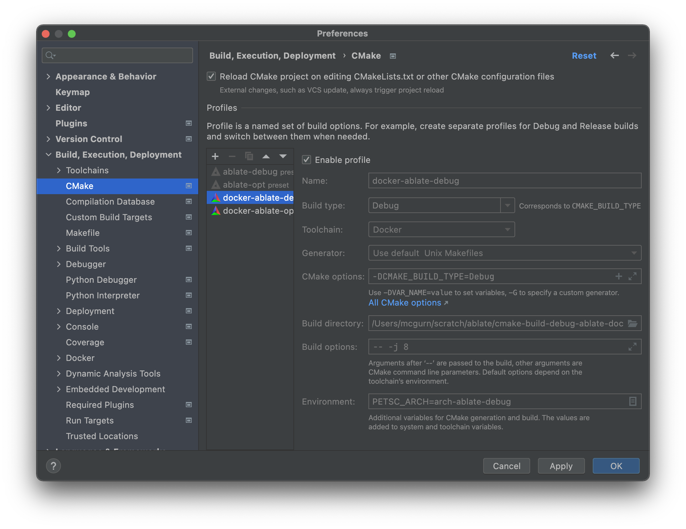
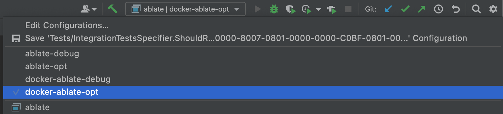

## Docker Install with CLion
CLion is a C/C++ IDE that uses cmake files for configuration. These directions outline the steps to running the framework with CLion.
1. Download and install [Docker](https://www.docker.com) or docker desktop.
2. Pull the latest ablate dependency docker image
   ```bash
   docker pull ghcr.io/ubchrest/ablate/ablate-dependencies-gcc:latest
   ```
3. Download and Install [CLion](https://www.jetbrains.com/clion/). For Windows users it is recommended that CLion be [installed under WSL2 linux](https://docs.microsoft.com/en-us/windows/wsl/tutorials/gui-apps).
4. Open CLion and select *Get From VCS* from the welcome window and either
   - (recommended) Select GitHub and Login/Authorize access. Then follow on-screen instructions to clone your [fork of ABLATE]({{ site.baseurl}}#forking-ablate).
   - Select Git from the *Version Control* dropdown and enter your [ABLATE fork url]({{ site.baseurl}}#forking-ablate).
4. Set the toolchain in CLion using the [instructions](https://www.jetbrains.com/help/clion/clion-toolchains-in-docker.html).  Select the ```ghcr.io/ubchrest/ablate/ablate-dependencies-gcc:latest``` image in the UI.
5. Enable the ```docker-ablate-debug``` and ```docker-ablate-opt``` build profiles.
   - If not opened by default, open the  Settings / Preferences > Build, Execution, Deployment > CMake preference window from the menu bar.
   - Select the ```docker-ablate-debug```  and click the "Enable profile". Repeat for the ```docker-ablate-opt``` and apply/close the window.
     
   - Select the ```docker-ablate-debug``` or ```docker-ablate-opt``` build profile under the build toolbar.  In short, the debug build makes it easier to debug but is slower.  The release/optimized build is faster to execute.
     
   - Disable any other profile
6. Build and run all tests using the *All CTest* configuration.
   
7. If you are new to CLion it is recommended that you read through the [CLion Quick Start Guide](https://www.jetbrains.com/help/clion/clion-quick-start-guide.html).
