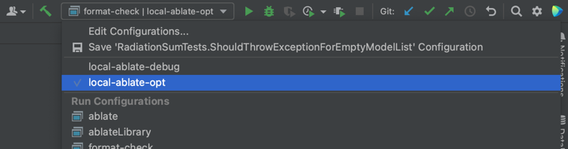

## Install ABLATE Dependencies
Keeping all dependency build steps updated can be difficult as they change often and are OS/platform specific. To allow the most up-to-date information to be available dependency build steps are maintained in the [ABLATE wiki](https://github.com/UBCHREST/ablate/wiki).  Please follow the step-by-step guides for your OS/platform on the ABLATE wiki to install the required dependencies. The latest version of ABLATE has been tested against PETSc .

## Downloading and Building with CLion (with installed dependencies)
CLion is a C/C++ IDE that uses cmake files for configuration. These directions outline the steps to running the framework with CLion.
1. Download and Install [CLion](https://www.jetbrains.com/clion/). For Windows users it is recommended that CLion be [installed under WSL2 linux](https://docs.microsoft.com/en-us/windows/wsl/tutorials/gui-apps).
2. Open CLion and select *Get From VCS* from the welcome window and either
   - (recommended) Select GitHub and Login/Authorize access. Then follow on-screen instructions to clone your [fork of ABLATE]({{ site.baseurl}}#forking-ablate).
   - Select Git from the *Version Control* dropdown and enter your [ABLATE fork url]({{ site.baseurl}}#forking-ablate).
3. Enable the ```ablate-debug``` and ```ablate-opt``` build profiles.
   - If not opened by default, open the  Settings / Preferences > Build, Execution, Deployment > CMake preference window from the menu bar.
   - Select the ```ablate-debug``` and click the "Enable profile". Repeat for the ```ablate-opt``` and apply/close the window.
     
   - Select the ```ablate-opt``` or ```ablate-debug``` build profile under the build toolbar.  In short, the debug build makes it easier to debug but is slower.  The release/optimized build is faster to execute.
     
   - Disable any other profile
4. Build and run all tests using the *All CTest* configuration.
   
5. If you are new to CLion it is recommended that you read through the [CLion Quick Start Guide](https://www.jetbrains.com/help/clion/clion-quick-start-guide.html).

## Downloading and Building with the Command Line
1. Clone your [ABLATE fork]({{ site.baseurl}}#forking-ablate) onto your local machine. It is recommended that you [setup passwordless ssh](https://docs.github.com/en/github/authenticating-to-github/adding-a-new-ssh-key-to-your-github-account) for accessing GitHub.
   ```bash
   git clone git@github.com:USERNAME/ablate.git
   ```
2. Create debug and release build directories
    ```bash
    mkdir debug
    mkdir release
    ```
3. Configure and build ABLATE
    ```bash
    # debug mode
    cmake -DCMAKE_BUILD_TYPE=Debug -B debug -S ablate
    make -C debug

    # release
    cmake -DCMAKE_BUILD_TYPE=Release -B release -S ablate
    make -C release
    ```
4. Run all the ABLATE tests
   ```bash
   cd release
   ctest
   ```