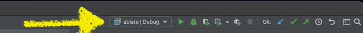
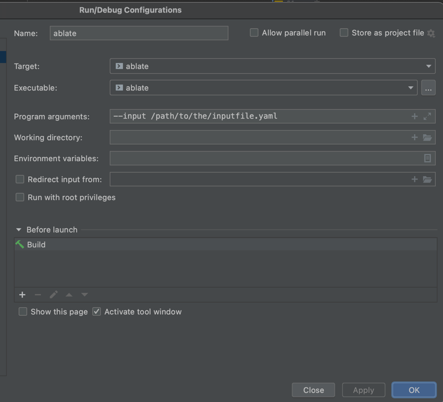

ABLATE includes a yaml parser for setting up and configuring simulations.  The yaml input files specifies all of the details of the simulation without the need to recompile the code.   These directions assume you have built ABLATE as outlined in [Building ABLATE Locally]({{ site.baseurl}}).  There are a variety of ways to build and interact with ABLATE including the command line and integrated development environments (IDEs). This document will cover using ablate built with the command line and [CLion](https://www.jetbrains.com/clion/).

## Obtaining Input Files
Download an example file and move to a location on your computer (should be placed outside the ablate repository).  Example files used for [integration testing are available](https://github.com/UBCHREST/ablate/tree/main/tests/integrationTests/inputs). 

## Yaml Input Files
At this point in time there is only a single YAML based implementation of a parser/factory. In this implementation arguments are passed as dictionary objects and lists.  When a class must be specified in YAML (no default specified) this must be done with a YAML tag.  For instance, in the following example the first particle in the list specified as a tracer particle initialized using a BoxInitializer.

```yaml
particles:
  - !ablate::particles::Tracer
    ndims: 3
    arguments:
      ts_max_steps: 2
      ts_dt: 0.05
      ts_convergence_estimate: ""
      ts_monitor_cancel: ""
    initializer: !ablate::particles::initializers::BoxInitializer
      arguments:
        particle_lower: 0.25,0.25,.25
        particle_upper: 0.75,0.75,.75
        Npb: 30
        convest_num_refine: 1
    exactSolutions:
      formula: "t + x + y"

```

## Running ABLATE from the Command Line
If you built ABLATE using the command line you can run ABLATE using either the debug or release builds.
    
    ```bash
    # navigate to either the debug or release directory of ABLATE
    ./ablate --input /path/to/the/inputfile.yaml

    # similarly, ABLATE can be run using mpi
    mpirun -n 3 ./abalte --input /path/to/the/inputfile.yaml
    ```

Other available command line arguments are listed in [Parser Command Line Arguments](#parser-command-line-arguments).

Parameters within the yaml file can be overwritten using the command line using the syntax ```-yaml::PATH::TO::PARAMETER updatedValue```.  For instance, the following command would update the Npb parameter in the above Yaml example ```-yaml::particles::initializer::arguments::Npb 40```.

## Running ABLATE from CLion
1. If you are new to CLion it is recommend that you read through the [CLion Quick Start Guide](https://www.jetbrains.com/help/clion/clion-quick-start-guide.html).
1. Select the ablate configuration from the configuration drop down.
    
1. Under the same menu select "Edit Configurations..." and enter the input file argument as shown.  Other available command line arguments are listed in [Parser Command Line Arguments](#parser-command-line-arguments).
    
1. Run or Debug ABLATE using the icons in the toolbar or under the Run menu.

## Parser Command Line Arguments

| Argument | Description |
| --- | ----------- |
| \-\-input | (required) The path to the Yaml input file |
| \-version | Prints the combined ABLATE and PETSc version information |
| \-\-version | Prints the ABLATE version information |
| \-\-help | Prints all available arguments for the Yaml input file |

