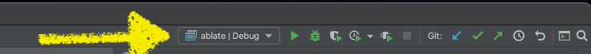
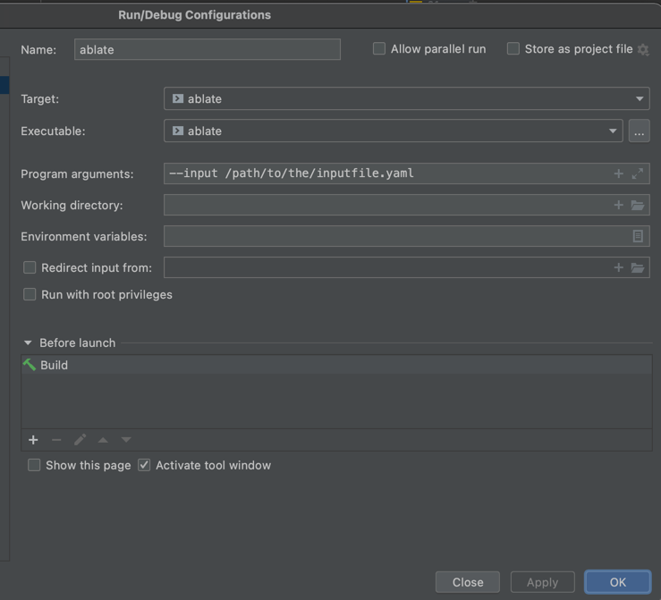

ABLATE includes a yaml parser for setting up and configuring simulations.  The yaml input files specifies all the details of the simulation without the need to recompile the code.   These directions assume you have built ABLATE as outlined in [Installation]({{ site.baseurl}}).  There are a variety of ways to build and interact with ABLATE including the command line and integrated development environments (IDEs). This document will cover using ablate built with the command line and [CLion](https://www.jetbrains.com/clion/).

## Input Files
ABLATE uses an [YAML input file]({{ site.baseurl}}) based implementation of a parser/factory.  In this implementation arguments are passed as dictionary objects and lists.  When a class must be specified in YAML (no default specified) this must be done with a YAML tag.  A full list of possible components and their required arguments is available under [Component List]({{ site.baseurl}}).  The minimum for an input file is outlined below where additional arguments must be provided for the time stepper and solver(s).

```yaml
# metadata for simulation
environment:
  # the simulation title and default output directory for results
  title: _example_simulation
  # if true, ablate will append the simulation start time to the output directory
  tagDirectory: false
  # optional directory argument, default is a new directory named for the title
  directory: path/to/directory
  
# default arguments passed to all petsc objects unless otherwise specified   
arguments: {}

# timestepper used to march in time.  The domain, fields, and other arguments must be specified
timestepper: {}

# a list of solvers to be used for the simulation
solvers: []

```

## Running ABLATE from the Command Line
If you built ABLATE using the command line you can run ABLATE using either the debug or release builds.
    
    ```bash
    # navigate to either the debug or release directory of ABLATE
    ./ablate --input /path/to/the/inputfile.yaml

    # similarly, ABLATE can be run using mpi
    mpirun -n 3 ./ablate --input /path/to/the/inputfile.yaml
    ```

Other available command line arguments are listed in [Parser Command Line Arguments](#parser-command-line-arguments).

Parameters within the yaml file can be overwritten using the command line using the syntax ```-yaml::PATH::TO::PARAMETER updatedValue``` or ```-yaml::PATH::[INDEX]::PARAMETER updatedValue``` if there is a list.  For instance, the following command would update the Npb parameter in the above Yaml example ```-yaml::particles::initializer::arguments::Npb 40```.

## Running ABLATE from CLion
1. If you are new to CLion it is recommended that you read through the [CLion Quick Start Guide](https://www.jetbrains.com/help/clion/clion-quick-start-guide.html).
1. Select the ablate configuration from the configuration drop down.
    
1. Under the same menu select "Edit Configurations..." and enter the input file argument as shown.  Other available command line arguments are listed in [Parser Command Line Arguments](#parser-command-line-arguments).
    
1. Run or Debug ABLATE using the icons in the toolbar or under the Run menu.

## Restarting a Simulation
ABLATE can restart/resume a simulation if the TimeStepper IO  was specified in the original run.  To restart the simulation set the environment directory to the previous run.  This can be done in input file or command line. Input parameters can be changed using the method outlined in [Running ABLATE from the Command Line](#running-ablate-from-the-command-line).

    ```bash
    mpirun -n 3 ./ablate --input /path/to/the/inputfile.yaml -yaml::environment::directory /path/to/previous/run/directory -yaml::timestepper::arguments::ts_max_steps 60
    ```

## Parser Command Line Arguments

| Argument | Description |
| --- | ----------- |
| \-\-input | (required) The path to the Yaml input file |
| \-version | Prints the combined ABLATE and PETSc version information |
| \-\-version | Prints the ABLATE version information |
| \-\-help | Prints all available arguments for the Yaml input file |
| \-yaml:: | Prefix for changing input arguments. See [Running ABLATE from the Command Line](#running-ablate-from-the-command-line).|

